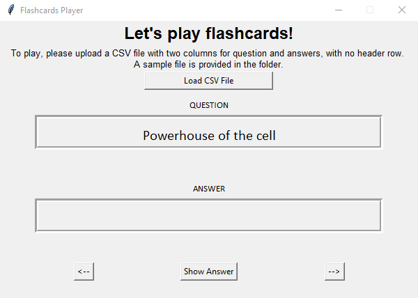
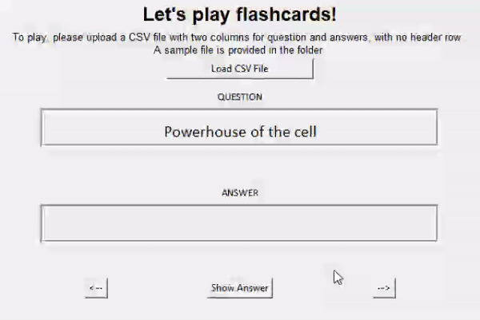

# Flashcard Player



It's a flashcard player application for you to use with your own flashcard CSV files!
Yes, you can freely import your own definitions or words that you want to revise into this application and go through them all conveniently.
This can be used to review various topics, depending on what you want to do with it, I obviously do not have control over that.

## Getting Started
Make sure you have [Python](https://www.python.org/) installed on your computer. 

1. **Clone the repository**

   ```bash
   git clone https://github.com/parinwarishui/FlashcardPlayer.git
   cd FlashcardPlayer

2. **Prepare your proper CSV files**

   The CSV file input into the application should have **two columns**, the first being the "question" side and the second being the "answer" side of the flashcards.

   The file **should not have a header row**, although if there is one then the application will treat it as another "pair" of questions/answers like the rest of the file.

3. **Open the application**

   If you prefer running the actual Python file, execute the following command in the directory:

   ```bash
   python main.py

If you prefer running the pre-built application, go inside the **dist** directory and open the file named **main.exe** to run the application.


## How to use the application?
1. A set of sample flashcards are already provided inside the application, which you can test before inserting your own files. The folder also includes two sets of flashcards (as .csv files) for you to use as well.
2. Use the **Show Answer** button to reveal the answer to a question in the flashcard set.
3. Use the **<--** and **-->** buttons to go through all of your flashcards.
4. Enjoy!

